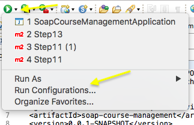
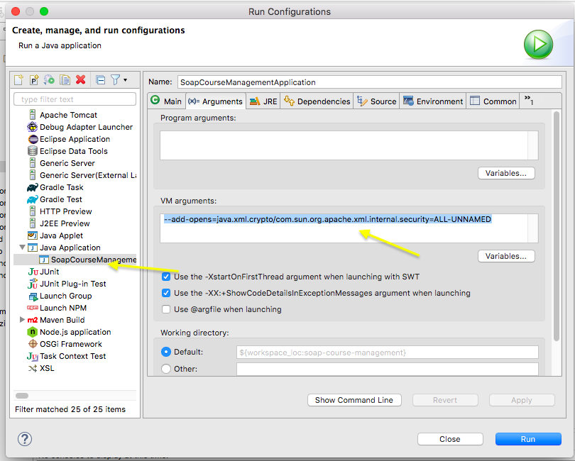

# SOAP Web Services with Spring boot 3.2.1
- Project: Maven
- Application Framework: Spring Boot (3.2.1)
- Language: Java (17)
- Packaging: Jar
- Dependencies: Spring Web, Spring Devtools, jaxb2, wsdl4j, JPA, MySQL.

## The PoC provides following

- What is SOAP Header, SOAP Body and SOAP Fault
- Endpoins for SOAP WS are GetCourseDetailsRequest, GetAllCourseDetailsRequest and DeleteCourseDetailsRequest? 
- Implement basic security with WS Security for SOAP Web Services (TODO).


## Steps

- Step 01 - Initialize a Spring Web Services application with Spring Boot
- Step 02 - Overview of creating SOAP Web Service using Contract First Approach
- Step 03 - Define Request and Response XML Structure
- Step 04 - Define XML Schema Definition (XSD) for Request - GetCourseDetailsRequest
- Step 05 - Define XML Schema Definition (XSD) for Respone - GetCourseDetailsResponse
- Step 06 - More about XML Schema Definition and Implementing XSD Best Practices
- Step 07 - Introduction to Java API for XML Binding (JAXB) and Configuring JAXB 2 Maven Plugin
- Step 08 - Configuring an Endpoint for GetCourseDetailsRequest
- Step 09 - Spring Web Services Configuration - Message Dispatcher Servlet
- Step 10 - Spring Web Services Configuration - Generating WSDL
- Step 11 - Using Wizdler to execute SOAP Requests
- Step 12 - Implementing a service - Course Details Service - backend MySQL (auto sql for test data) and JPA.
- Step 13 - Implementing SOAP Web Service for GetAllCourseDetailsRequest
- Step 15 - Implementing SOAP Web Service for DeleteCourseDetailsRequest
- Step 16 - DeleteCourseDetailsRequest - Using an Enum for Status
- Step 17 - Exception Handling and SOAP Fault Responses
- Step 18 - Implementing Security for SOAP Web Services with WS Security (TODO)

## Creare WSDL by using following URL in Chrome Browser

- http://localhost:2028/ws/courses.wsdl
- Save the WSDL and configure with SOAPUI for testing. 

## Security Dependencies (TODO)

```xml
	<dependency>
            <groupId>org.springframework.ws</groupId>
            <artifactId>spring-ws-security</artifactId>
            <exclusions>
                <exclusion>
                    <groupId>org.springframework.security</groupId>
                    <artifactId>spring-security-core</artifactId>
                </exclusion>
            </exclusions>
        </dependency>
        
```    

## Security Request
```xml
<Envelope xmlns="http://schemas.xmlsoap.org/soap/envelope/">
	<Header>
		<wsse:Security
			xmlns:wsse="http://docs.oasis-open.org/wss/2004/01/oasis-200401-wss-wssecurity-secext-1.0.xsd"
			mustUnderstand="1">
			<wsse:UsernameToken>
				<wsse:Username>user</wsse:Username>
				<wsse:Password>password</wsse:Password>
			</wsse:UsernameToken>
		</wsse:Security>
	</Header>
	<Body>
		<GetCourseDetailsRequest xmlns="http://tech.com/courses">
			<id>1</id>
		</GetCourseDetailsRequest>
	</Body>
</Envelope>
```

## securityPolicy.xml
```
<?xml version="1.0" encoding="UTF-8"?>
<xwss:SecurityConfiguration 
xmlns:xwss="http://java.sun.com/xml/ns/xwss/config">
	<xwss:RequireUsernameToken
		passwordDigestRequired="false" nonceRequired="false" />
</xwss:SecurityConfiguration>
```

## Error
java.lang.NoClassDefFoundError: jakarta/wsdl/extensions/ExtensibilityElement

## Security with WS-Security (TODO)
 - Authentication
 - Digital signatures
 - Certificates
 
 - Implementation -> XWSS - XML and Web Services Security.
   - Security Policy
   - XwsSecurityInterceptor


### /example-files/Request-Security.xml

```xml
<Envelope xmlns="http://schemas.xmlsoap.org/soap/envelope/">
	<Header>
		<wsse:Security
			xmlns:wsse="http://docs.oasis-open.org/wss/2004/01/oasis-200401-wss-wssecurity-secext-1.0.xsd"
			mustUnderstand="1">
			<wsse:UsernameToken>
				<wsse:Username>user</wsse:Username>
				<wsse:Password>password</wsse:Password>
			</wsse:UsernameToken>
		</wsse:Security>
	</Header>
	<Body>
		<GetCourseDetailsRequest xmlns="http://tech.com/courses">
			<id>1</id>
		</GetCourseDetailsRequest>
	</Body>
</Envelope>
```
---

### /example-files/Request.xml

```xml
<Envelope xmlns="http://schemas.xmlsoap.org/soap/envelope/">
	<Body>
		<GetCourseDetailsRequest xmlns="http://tech.com/courses">
			<id>1</id>
		</GetCourseDetailsRequest>
	</Body>
</Envelope>
```
---

### /example-files/Response-Fault.xml

```xml
<SOAP-ENV:Envelope xmlns:SOAP-ENV="http://schemas.xmlsoap.org/soap/envelope/">
	<SOAP-ENV:Header />
	<SOAP-ENV:Body>
		<SOAP-ENV:Fault>
			<faultcode xmlns:ns0="http://tech.com/courses">ns0:001_COURSE_NOT_FOUND</faultcode>
			<faultstring xml:lang="en">Invalid Course Id 1234</faultstring>
		</SOAP-ENV:Fault>
	</SOAP-ENV:Body>
</SOAP-ENV:Envelope>
```
---

### /example-files/Response.xml

```xml
<SOAP-ENV:Envelope xmlns:SOAP-ENV="http://schemas.xmlsoap.org/soap/envelope/">
    <SOAP-ENV:Header/>
    <SOAP-ENV:Body>
        <ns2:GetCourseDetailsResponse xmlns:ns2="http://tech.com/courses">
            <ns2:CourseDetails>
                <ns2:id>1</ns2:id>
                <ns2:name>Spring</ns2:name>
                <ns2:description>10 Steps</ns2:description>
            </ns2:CourseDetails>
        </ns2:GetCourseDetailsResponse>
    </SOAP-ENV:Body>
</SOAP-ENV:Envelope>
```
---

### /src/main/resources/course-details.xsd
```
<?xml version="1.0" encoding="UTF-8"?>

<xs:schema xmlns:xs="http://www.w3.org/2001/XMLSchema"
	targetNamespace="http://tech.com/courses" xmlns:tns="http://tech.com/courses"
	elementFormDefault="qualified">

	<xs:element name="GetCourseDetailsRequest">
		<xs:complexType>
			<xs:sequence>
				<xs:element name="id" type="xs:int" />
			</xs:sequence>
		</xs:complexType>
	</xs:element>

	<xs:element name="GetCourseDetailsResponse">
		<xs:complexType>
			<xs:sequence>
				<xs:element name="CourseDetails" type="tns:CourseDetails" />
			</xs:sequence>
		</xs:complexType>
	</xs:element>

	<xs:element name="GetAllCourseDetailsRequest">
		<xs:complexType>
		</xs:complexType>
	</xs:element>

	<xs:element name="GetAllCourseDetailsResponse">
		<xs:complexType>
			<xs:sequence>
				<xs:element name="CourseDetails" type="tns:CourseDetails"
					maxOccurs="unbounded" />
			</xs:sequence>
		</xs:complexType>
	</xs:element>

	<xs:element name="DeleteCourseDetailsRequest">
		<xs:complexType>
			<xs:sequence>
				<xs:element name="id" type="xs:int" />
			</xs:sequence>
		</xs:complexType>
	</xs:element>

	<xs:element name="DeleteCourseDetailsResponse">
		<xs:complexType>
			<xs:sequence>
				<xs:element name="status" type="tns:Status" />
			</xs:sequence>
		</xs:complexType>
	</xs:element>

	<xs:simpleType name="Status">
		<xs:restriction base="xs:string">
			<xs:enumeration value="SUCCESS" />
			<xs:enumeration value="FAILURE" />
		</xs:restriction>
	</xs:simpleType>

	<xs:complexType name="CourseDetails">
		<xs:sequence>
			<xs:element name="id" type="xs:int" />
			<xs:element name="name" type="xs:string" />
			<xs:element name="description" type="xs:string" />
		</xs:sequence>
	</xs:complexType>

</xs:schema>
```
---

### /src/main/resources/securityPolicy.xml

```xml
<?xml version="1.0" encoding="UTF-8"?>
<xwss:SecurityConfiguration 
	xmlns:xwss="http://java.sun.com/xml/ns/xwss/config">
	<xwss:RequireUsernameToken
		passwordDigestRequired="false" nonceRequired="false" />
</xwss:SecurityConfiguration>
```
---
## Debugging Help

If you get an error `java.lang.IllegalAccessError: class com.sun.xml.wss.impl.SecurableSoapMessage cannot access class com.sun.org.apache.xml.internal.security.Init`, We can open up the package for unnamed modules


--add-opens=java.xml.crypto/com.sun.org.apache.xml.internal.security=ALL-UNNAMED


In Eclipse, you can configure VM arguments:


